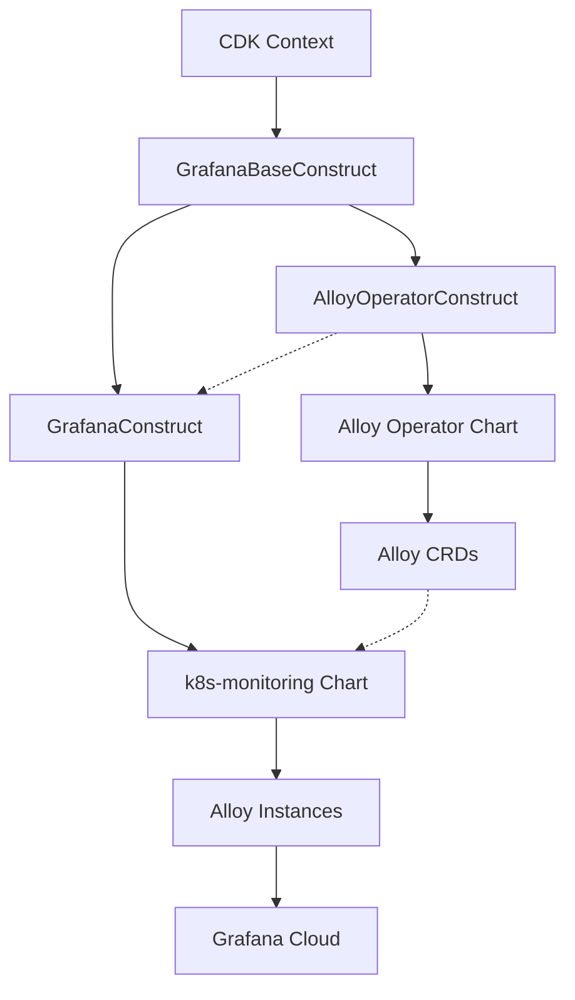

# Grafana Cloud Observability Integration

## Overview

The CDK Common framework provides comprehensive integration with Grafana Cloud for Kubernetes observability through a
coordinated deployment of the Alloy Operator and k8s-monitoring Helm charts. This integration enables complete telemetry
collection including metrics, logs, traces, and continuous profiling.

## Architecture

### Component Relationships



### Deployment Flow

1. **Context Validation** - Both constructs validate Grafana Cloud configuration
2. **AlloyOperator Deployment** - Installs CRDs and operator controller
3. **k8s-monitoring Deployment** - Deploys telemetry collection agents
4. **Telemetry Collection** - Alloy instances collect and forward data to Grafana Cloud

## Configuration

### Required CDK Context Keys

The following context keys must be configured in your `cdk.context.json`:

```json
{
  "hosted:eks:grafana:key": "glc_your_grafana_api_key",
  "hosted:eks:grafana:instanceId": "your_instance_id",
  "hosted:eks:grafana:lokiHost": "https://logs-prod-region.grafana.net",
  "hosted:eks:grafana:lokiUsername": "your_loki_username",
  "hosted:eks:grafana:prometheusHost": "https://prometheus-prod-region.grafana.net",
  "hosted:eks:grafana:prometheusUsername": "your_prometheus_username",
  "hosted:eks:grafana:tempoHost": "https://tempo-prod-region.grafana.net/tempo",
  "hosted:eks:grafana:tempoUsername": "your_tempo_username",
  "hosted:eks:grafana:pyroscopeHost": "https://profiles-prod-region.grafana.net:443"
}
```

### Chart Configuration

#### AlloyOperator Configuration (`helm/alloy-operator.mustache`)

```yaml
# Minimal configuration for Alloy Operator
enabled: true
resources:
  limits:
    cpu: 500m
    memory: 128Mi
  requests:
    cpu: 10m
    memory: 64Mi
```

#### k8s-monitoring Configuration (`helm/grafana.mustache`)

```yaml
cluster:
  name: "{{hosted:id}}-eks"

destinations:
  - name: grafana-cloud-metrics
    type: prometheus
    url: {{hosted:eks:grafana:prometheusHost}}/api/prom/push
    auth:
      type: basic
      username: "{{hosted:eks:grafana:prometheusUsername}}"
      password: {{hosted:eks:grafana:key}}

# Additional destinations for logs, traces, profiles...
```

## Implementation Details

### Base Class Architecture

The `GrafanaBaseConstruct` provides shared functionality:

```java
public abstract class GrafanaBaseConstruct extends Construct {
  /**
   * Creates a GrafanaSecret from CDK context values.
   * Returns null if any required context values are missing.
   */
  protected static GrafanaSecret createSecretFromContext(Construct scope) {
    // Validates all required context keys
    // Returns null for graceful degradation if context is incomplete
  }
}
```

### Context Validation Strategy

Both `AlloyOperatorConstruct` and `GrafanaConstruct` extend the base class and:

1. Validate Grafana context on construction
2. Skip deployment gracefully if context is missing
3. Deploy as a coordinated unit when context is complete

### Error Handling

```java
var secret = createSecretFromContext(scope);
if (secret == null) {
  this.chart = null;  // Graceful skip
  return;
}
// Continue with deployment...
```

## Deployment Dependencies

### Dependency Chain

```
AddonsConstruct → AlloyOperatorConstruct → GrafanaConstruct
                      ↓                        ↓
                  Alloy CRDs            k8s-monitoring Chart
                      ↓                        ↓
                 CRD Installation      Alloy Instance Creation
```

### CDK Dependency Management

```java
this.alloyOperator = new AlloyOperatorConstruct(this, common, addons.alloyOperator(), cluster);
this.grafana = new GrafanaConstruct(this, common, addons.grafana(), cluster);
this.grafana().getNode().addDependency(this.alloyOperator());
```

## Chart Version Compatibility

### k8s-monitoring Chart Evolution

- **v2.x** - Used direct Alloy configuration without operator
- **v3.0+** - Requires Alloy Operator and CRDs (current implementation)

### Version Pinning

```yaml
# addons.mustache configuration
alloyOperator:
  chart:
    name: alloy-operator
    version: 0.3.8  # Pinned for CRD compatibility

grafana:
  chart:
    name: k8s-monitoring
    version: 3.3.2  # Latest v3 with Alloy Operator support
```

## Troubleshooting

### Common Issues

#### 1. Missing Context Values

**Error**: `missing required grafana context values, skipping grafana-related deployments`
**Solution**: Verify all required context keys are present in `cdk.context.json`

#### 2. Alloy CRD Not Found

**Error**: `The k8s-monitoring Helm chart v3.0 requires the Alloy CRD to be deployed`
**Solution**: Ensure AlloyOperatorConstruct is deployed before GrafanaConstruct

#### 3. Chart Version Mismatch

**Error**: Various deployment failures
**Solution**: Verify chart versions are compatible (Alloy Operator 0.3.8+ for k8s-monitoring 3.0+)

### Debug Commands

```bash
# Check CRD installation
kubectl get crd alloys.alloy.grafana.com

# Verify operator deployment
kubectl get pods -n alloy-system

# Check k8s-monitoring deployment
kubectl get pods -n monitoring

# Validate Alloy instances
kubectl get alloys -n monitoring
```

## Migration Notes

### From Secrets Manager to CDK Context

- Previous versions used AWS Secrets Manager for Grafana credentials
- Current implementation uses CDK context for build-time injection
- No runtime AWS API calls for credential retrieval
- Improved security through build-time credential handling

### Chart Upgrade Path

1. Update context configuration with required keys
2. Deploy AlloyOperator construct first
3. Upgrade k8s-monitoring to v3.3.2
4. Verify telemetry flow to Grafana Cloud

## Best Practices

### Security

- Store sensitive context values in secure CI/CD variables
- Rotate Grafana API keys regularly
- Use separate keys for different environments

### Monitoring

- Monitor AlloyOperator pod health
- Verify Grafana Cloud data ingestion
- Set up alerts for telemetry pipeline failures

### Maintenance

- Pin chart versions for predictable deployments
- Test upgrades in non-production environments
- Monitor Grafana's chart release notes for breaking changes